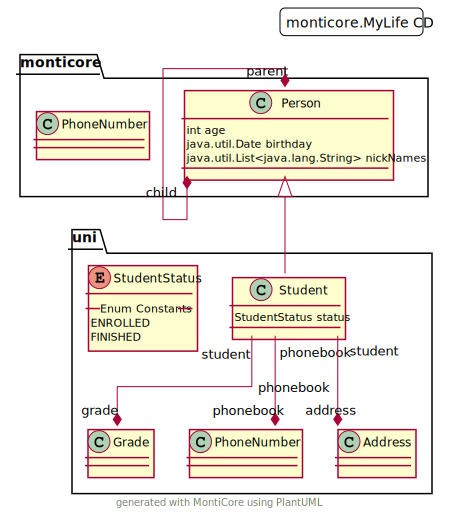

<!-- (c) https://github.com/MontiCore/monticore -->

This introduction is 
intended for  *modelers* who use the class diagram (CD)
languages. We also provide a 
[detailed documentation of CD languages](src/main/grammars/de/monticore/cd4analysis.md). 
for *language engineers* using or
extending one of the CD languages.

The CD languages are mainly intended for  
1. Analysis modelling (i.e. structures of the system context 
   as well as data structures of the system),
1. Code modelling (implementation) oriented, including method signatures,
1. Generating code, data tables, transport functions and more.
1. It is also possible to use CDs only as intermediate structure
   to map from one or more other DSLs into an object-oriented 
   target language, such as Java or C++. 
   (E.g. the MontiCore generator maps grammars to CDs before generating code
   from there).
1. Finally CDs can also be used as reported results from any other 
   generation or analysis process.

# An Example Model

The following example CD `MyLife` illustrates the textual syntax of CDs:
```
package monticore;

classdiagram MyLife { 
  abstract class Person {
    int age;
    java.util.Date birthday;
    java.util.List<java.lang.String> nickNames;
  }
  class PhoneNumber;
  package uni {
    class Student extends Person {
      StudentStatus status;
      -> Address [1..*] {ordered};
    }
    class Grade;
    enum StudentStatus { ENROLLED, FINISHED; }
    composition Student -> Grade [*];
    association phonebook uni.Student [java.lang.String] -> PhoneNumber;
  }
  association [0..1] Person (parent) <-> (child) monticore.Person [*];
}
```
The CD is contained in the package `monticore` and is called `MyLife`.
The example CD shows
- the definition of the two classes `Person` and `Student`.
- the abstract class `Person`.
- the class `Student` extending the class `Person` (like in Java); interfaces
  are also be possible.
- classes containing attributes, which have a type and a name.
- available default types, which are basic types (from Java), imported types 
  (like `java.util.Date`), and predefined forms of generic types (like `java.util.List`).
- associations and compositions that are defined between two classes and
  can have a name, a navigation information (e.g. `<->`), role names on both
  sides, multiplicities (like `[0..1]`) and certain predefined tags/stereotypes 
  (like `{ordered}`).
- that both, association and compositions, can be qualified for example by 
  `[java.lang.String]`.
- that packages can be used to structure the classes contained in the model.

Further examples can be found [here][ExampleModels].

The CD language infrastructure can be used as CLI tool from shell as well 
as within gradle or just as framework with dirct Java API access.

# Command Line Interface
 
This section describes the CLI tool of the CD language. 
The CLI tool provides typical functionality used when
processing models. It provides funcionality
for 
* parsing including coco-checking and creating symbol tables, 
* pretty-printing, 
* storing symbols in symbol files, 
* loading symbols from symbol files, and 
* transforming CDs into the svg format and textual PlantUML models. 

The requirements for building and using the CD CLI tool are that Java 8, Git, 
and Gradle are installed and available for use e.g. in Bash. 

## Downloading the Latest Version of the CLI Tool

A ready to use version of the CLI tool can be downloaded in the form of an
executable JAR file.
You can use [**this download link**][CLIDownload] for downloading the CLI tool. 

Or you can use `wget`. This
command downloads the latest version of the CLI tool 
under the name `CDCLI.jar` in your working directory:
```shell
wget "http://monticore.de/download/CDCLI.jar" -O CDCLI.jar
``` 

## Building the CLI Tool from the Sources (if desired)
 
As alternative to a download, 
it is possible to build an executable JAR of the CLI tool from the source files
located in GitHub. The following describes the process for building the CLI tool
from the source files using Bash. For building an executable Jar of the CLI with
Bash from the source files available in GitHub, execute the following commands.

First, clone the repository:
```shell
git clone https://github.com/MontiCore/cd4analysis.git
```
Change the directory to the root directory of the cloned sources:
```shell
cd cd4analysis
```
Then build the source files with gradle (if `./gradlew.bat` is not 
recognized as a command in your shell, then use `./gradlew`).
To this effect, execute the following two commands:
```shell
./gradlew.bat clean build
./gradlew.bat shadowJar
```
Congratulations! You can now find the executable JAR file `CDCLI.jar` in
the directory `target/libs`.

## Tutorial: Getting Started Using the CD CLI Tool

The following small tutorial should help to get an idea 
of how to use the CD CLI tool given in `CDCLI.jar`.

### First Steps

Let us execute the CLI tool with the following 
command and no parameters:
```shell
java -jar CDCLI.jar
```

This prints usage information of the CLI 
tool to the console:
```shell
$ java -jar CDCLI.jar
usage: Examples in case the CLI file is called CDCLI.jar:
java -jar CDCLI.jar -i Person.cd -p target:src/models -o target/out -t true -s
java -jar CDCLI.jar -i Person.cd -pp Person.out.cd -puml --showAtt --showRoles
 -f,--failquick <value>                   Configures if the application should quickfail on errors
                                          [true/false]. The default value is "false".
    --fieldfromrole <fieldfromrole>       Configures if field symbols should be created from rolesymbols
                                          [none,all,navigable]. The default value is "none".
 -h,--help                                Print this help dialogue.
 -i,--input <file>                        Reads the input CD artifact given as argument.
 -o,--output <dir>                        Path of generated files (optional). The default value is ".".
 -p,--path <dirlist>                      Sets the artifact path for imported symbols separated by ';'. The
                                          default value is ".".
 -pp,--prettyprint <prettyprint>          Prints the input CDs to stdout or to the specified file (optional).
 -puml,--plantUML                         Transform the input model to a PlantUML model.
 -r,--report <dir>                        Prints reports of the parsed artifact to the specified directory
                                          (optional). Available reports are language-specific. The default
                                          value is "_output_path_".
 -s,--symboltable <file>                  Serializes and prints the symbol table to stdout or the specified
                                          output file (optional). The default value is
                                          "{inputArtifactName}.cdsym".
 -stdin,--stdin                           Reads the path to the input CD artifact from stdin.
 -t,--usebuiltintypes <useBuiltinTypes>   Configures if built-in-types should be considered [true/false]. The
                                          default value is "true".
```

To work properly, the CLI tool needs the mandatory argument `-i,--input <file>`,
which takes file containing CD models as input.
If no further options are specified, the CLI tool processes the model,
but does not produce any further output.
That means it parses the model, builds its 
symbol table, and then checks whether the model satisfies all context 
conditions. Only errors or success are printed.


For trying this out, copy the `CDCLI.jar` into a directory of your 
choice. Afterwards, create a text file `Example.cd` 
containing the following simple CD 
(please note that like in Java, filename and modelname in the file are
 equal):
```
classdiagram Example {
  class Person {
    int age;
    java.lang.String surname;
  }
}
```

Save the text file as `Example.cd` in the directory where `CDCLI.jar` is 
located. 

Now execute the following command:
```
java -jar CDCLI.jar -i Example.cd
```

You may notice that the CLI tool prints the following text to the console:
```
Successfully parsed Example
Successfully checked the CoCos for Example
```

The contents of the input CD artifact can also be piped to the CLI tool.
For trying this out, execute the following command:

```shell
cat Example.cd | java -jar CDCLI.jar --stdin
``` 
The output is the same as for the previous command.

### Step 2: Pretty-Printing

The CLI tool provides a pretty-printer for the CD language.
A pretty-printer can be used, e.g., to fix the formatting of files containing 
CDs, but has its main application to print internally constructed 
or transformed CDs.

To execute the pretty-printer, the `-pp,--prettyprint` option can be used.
Using the option without any arguments pretty-prints the models contained in the
input files to the console:

```shell
java -jar CDCLI.jar -i Example.cd -pp
```
The command prints the pretty-printed model contained in the input file to the 
console:
```
classdiagram Example {
  class Person {
    int age;
    java.lang.String surname;
  }
  
  association Person -> (associates) Person [*];
}
```

It is possible to pretty-print the models contained in the input file to an 
output file (here: `PPExample.cd`):

```shell
java -jar CDCLI.jar -i Example.cd -pp PPExample.cd
```

### Step 3: Storing Symbols

Now we will use the CLI tool to store a symbol file for our `Example.cd` model.
The stored symbol file will contain information about the types and associations
defined in the CD.
It can be imported by other models for using the introduced symbols.

Using the `-s,--symboltable <file>` option builds the symbol table of the input
model and stores it in the file path given as argument.
Providing the file path is optional.
If you do not provide a file path, the CLI tool stores the symbol table of the
input model in the file `{fileName}.cdsym` where `fileName` is the name of the
file containing the input model in the directory where the input file is located
.

For storing the symbol file of `Example.cd`, execute the following command
(the context condition checks require using the path option):
```shell
java -jar CDCLI.jar -i Example.cd -s
```
The CLI tool produces the file `Example.sym`, which can now be
imported by other models, e.g., by models that need to
use some of the types defined in the CD `Example`. The tool additionally
indicates the correct generation by its outputs:
```
Successfully parsed Example
Successfully checked the CoCos for Example
Creation of symbol table Example.sym successful
```
The symbol file contains a JSON representation of the symbols defined in a model
. In this case, the symbol file contains information about defined types.

For storing the symbol file of `Example.cd` in the file `syms/Example.sym`,
for example, execute the following command (again, the implicit context 
condition checks require using the model path option):
```shell
java -jar CDCLI.jar -i Example.cd -s syms/Example.sym
```

#### Creating `FieldSymbol`s from `CDRoleSymbol`s

By default, the CLI does not create `FieldSymbol`s for the `CDRoleSymbol`s.
Currently there are two different behaviors:
1. For each of the `CDRoleSymbol`s create a linked `FieldSymbol` in the source
   of the role.
   This can be used in languages, that always allow for the navigation in both
   directions.
2. Create `FieldSymbol`s only for navigable roles.
   This should be preferred, as the model explicitly states, that a role is
   not navigable.

Case 1 can be used with:
```shell
java -jar CDCLI.jar -i Example.cd -s syms/Example.sym --fieldfromrole all
```
- a `FieldSymbol` was created for both sides of the association
and case 2 with:
```shell
java -jar CDCLI.jar -i Example.cd -s syms/Example.sym --fieldfromrole navigable
```
- a `FieldSymbol` was only created for the navigable Role `associates`

### Step 4: Importing Symbol Files Using a Path

MontiCore is designed for modularity (both on the model and the language level).
The CD languages are participating in the symbol exchange infrastructure.
We import a symbol file defining type symbols that are used by 
a CD.

Let us now consider the example `MyLife` from above.
Please, copy the content of `MyLife` and save it 
in a file `monticore/MyLife.cd`. The directory `monticore` is needed 
because of the package definition in line 1.

Execute the following command for processing the file `MyLife.cd`:
```shell
java -jar CDCLI.jar -i monticore/MyLife.cd
```

After executing the command, 
the output states that a context condition is not satisfied by
the model: 
```
[ERROR] MyLife.cd:<13,9>: 0xCDA80: Type 'Address' is used but not defined.
[ERROR] 0xA1038 TypeSymbolSurrogate Could not load full information of 'Address' (Kind de.monticore.symbols.basicsymbols._symboltable.TypeSymbol).
...
```

To define the missing the type `Address`, another model is needed.
Respectively its symbol table has to be available in the file system.

The symbol file of this model has to be imported by the CD model. 
The type can be defined in an arbitrary model of an arbitrary language, 
this other model only needs to be processed and its symbols stored beforehand.
This approach has a number of advantages:
* it allows us to use the CD language with any other language that defines
  types,
* the tools themselves remain decoupled, 
* the build process can be organized in an incremental effective way
    (when using e.g. `gradle` or make, but not mvn). 
* even symbols from languages that not defined with MontiCore can be
  integrated (e.g. we do that with handwritten code from programming languages).

The following describes how to fix the error in the example model `MyLife.cd` 
by importing a symbol file defining the (yet undefined) type. 
We make use of the model path and provide the CLI tool with
a symbol file (stored symbol table) of another model, which contains the 
necessary type information.

Create a new directory `mytypes` in the directory where the CLI tool `CDCLI.jar`
is located. The symbol file `AddressType.sym`, which provides all necessary type
information, can be created from the `AddressType.cd` that can be found
[here](doc/AddressType.cd).
Download the file, name it `AddressType.cd`, and move it into the directory 
`mytypes`. The next step is to create the symboltable from the model. This is 
done by:
```shell
java -jar CDCLI.jar -i mytypes/AddressType.cd -s mytypes/AddressType.sym
```
  
The path containing the directory structure that contains the symbol file is 
called the "Model Path". If we provide the model path to the tool, it will 
search for symbols in symbol files, which are stored in directories contained in
the model path. So, if we want the tool to find our symbol file, we have to 
provide the model path to the tool via the `-p,--path <dirlist> ` option:
```shell
java -jar CDCLI.jar -i monticore/MyLife.cd -p <MODELPATH>
```
where `<MODELPATH>` is the path where you stored the downloaded symbol file.
In our example, in case you stored the model in the directory `mytypes`,
execute the following command:
```shell
java -jar CDCLI.jar -i monticore/MyLife.cd -p mytypes
```

Well, executing the above command still produces the same error message.
This is because the symbol file needs to be imported first, just like in Java.
Therefore, we add the following import statement to the beginning of the 
contents contained in the file `MyLife.cd` containing the CD `MyLife`:
```
package monticore;

import AddressType;

classdiagram MyLife {
  ...
}
```
The added import statement means that the file containing the CD imports all
symbols that are stored in the symbol file `Address`. 
Note that you may have to change the name here, depending on how you named the
symbol file from above.
The file ending of the symbol file must be `.sym`.

If we now execute the command again, the CLI tool will print the following 
output: 

```
Successfully parsed MyLife
Successfully checked the CoCos for MyLife
```

This means that it processed 
the model successfully without any context condition violations.
Great! 

Congratulations, you have just finished the tutorial about saving CD symbol files!

### Using PlantUML to create graphical representations of CD files

The CDCLI provides the option to create plantUML and svg files.
PlantUML can be configured further to add additional details.
Using the previously used model files, a plantUML model can be created with:
```shell
java -jar CDCLI.jar -i monticore/MyLife.cd -p mytypes -puml
```

If there is no given output name, then the name of the model is used.

Additionally to the used cli parameter, CDCLI can be configured for PlantUML
using futher options specifically for PlantUML output:
```shell
$ java -jar CDCLI.jar -h -puml
...
usage: PLANTUML
 -assoc,--showAssociations            show associations [true] when used. The default value is "false".
 -attr,--showAttributes               show attributes [true] when used. The default value is "false".
 -card,--showCardinality              show cardinalities [true] when used. The default value is "false".
 -comment,--showComments              show comments [true] when used. The default value is "false".
 -mod,--showModifier                  show modifier [true] when used. The default value is "false".
    --nodeSeparator <nodesep>   set the node separator [number]. The default value is "-1".
    --orthogonal                      show lines only orthogonal [true] when used. The default value is
                                      "false".
    --rankSeparator <ranksep>   set the rank separator [number]. The default value is "-1".
    --showRoles                   show roles [true] when used. The default value is "false".
    --shortenWords                shorten displayed words [true] when used. The default value is "false".
    --svg                             print as plantUML svg
```

A SVG can be created by passing the parameter `--svg`.
The svg 

is created by the command:
```shell
java -jar CDCLI.jar -i monticore/MyLife.cd -p mytypes -puml MyLife --orthogonal -attr -assoc --showRoles --svg
```

[ExampleModels]: src/test/resources/de/monticore/cd4analysis
[CLIDownload]: http://monticore.de/download/CDCLI.jar

## Further Information

* [Project root: MontiCore @github](https://github.com/MontiCore/monticore)
* [MontiCore documentation](http://www.monticore.de/)
* [**List of languages**](https://github.com/MontiCore/monticore/blob/dev/docs/Languages.md)
* [**MontiCore Core Grammar Library**](https://github.com/MontiCore/monticore/blob/dev/monticore-grammar/src/main/grammars/de/monticore/Grammars.md)
* [Best Practices](https://github.com/MontiCore/monticore/blob/dev/docs/BestPractices.md)
* [Publications about MBSE and MontiCore](https://www.se-rwth.de/publications/)
* [Licence definition](https://github.com/MontiCore/monticore/blob/master/00.org/Licenses/LICENSE-MONTICORE-3-LEVEL.md)

